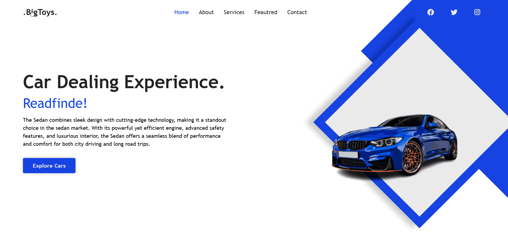

# 🚗 BigToys – Car Dealership Landing Page

This is a responsive and stylish landing page created for a fictional car dealership named **BigToys**, built during my internship at **OctaNet**.

It provides an elegant user interface to showcase services, car categories, and dealership branding.

---

## 🌟 Overview

- Eye-catching hero section with call-to-action
- Services and About sections
- Responsive design
- Built for desktop and mobile viewing
- Contact form layout (non-functional)

---

## 🛠 Tech Stack

- **HTML**
- **CSS**
- **JavaScript**

---

## Live Demo


---

## 🚀 How to Run Locally

1. **Clone this repo**  
   ```bash
   git clone https://github.com/yourusername/BigToys.git
   cd BigToys
   ```
2. **Open index.html in any browser**   
